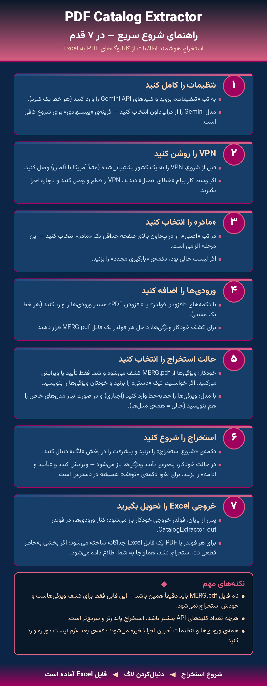

<div align="center">

# 📄 PDF Catalog Extractor

**استخراج هوشمند اطلاعات از کاتالوگ‌های PDF به Excel — با استفاده از Gemini**

اپ دسکتاپ ویندوزی (رابطِ فارسیِ راست‌به‌چپ، تمِ تیره) که چند فولدر یا PDF می‌گیرد و **یک فایلِ Excelِ یکپارچه** تحویل می‌دهد.

> فایلِ اصلیِ نسخه‌ی فعلی: `pdf_extractor_finalV22.py`

</div>

---

## 🚀 راهنمای شروع سریع (۷ قدم)

<div align="center">



</div>

| قدم | کار |
|:---:|-----|
| **۱** | **تنظیمات را کامل کن** — کلید(های) Gemini API را وارد کن (هر خط یک کلید) و مدل را انتخاب کن (پیش‌فرض: `gemini-3.1-flash-lite`). |
| **۲** | **VPN را روشن کن** — Gemini در ایران مسدود است؛ VPN را به کشوری که Gemini پشتیبانی می‌کند (آمریکا، آلمان…) وصل کن. |
| **۳** | **«مادر» را انتخاب کن** — از لیستِ چندانتخابی حداقل یک مادر (دسته/موضوع) انتخاب کن. *(الزامی)* |
| **۴** | **ورودی‌ها را اضافه کن** — فولدر یا PDF اضافه کن. در حالتِ خودکار، فایلِ `MERG.pdf` داخلِ فولدر برای کشفِ ویژگی‌ها استفاده می‌شود. |
| **۵** | **حالتِ استخراج را انتخاب کن** — «خودکار» (کشفِ ویژگی از MERG) یا «با مدل» (تو مدل‌ها و ویژگی‌ها را می‌دهی). |
| **۶** | **شروع کن** — دکمه‌ی «شروع استخراج». خروجی در فولدرِ `CatalogExtractor_out/<تاریخ_ساعت>/` ساخته می‌شود. |
| **۷** | **خروجیِ Excel را تحویل بگیر** — **یک فایلِ Excelِ یکپارچه** برای کلِ اجرا؛ فولدرِ خروجی خودکار باز می‌شود. |

> **نکته:** فایلِ `MERG.pdf` باید دقیقاً همین نام را داشته باشد — این فایل فقط برای کشفِ ویژگی‌هاست و خودش در خروجی نمی‌آید.

---

## ✨ قابلیت‌ها

- **خروجیِ یکپارچه:** کلِ اجرا (همه‌ی فولدرها/PDFها) در **یک فایلِ `merged_<تاریخ>.xlsx`** ادغام می‌شود؛ ستونِ «فایل منبع» می‌گوید هر ردیف از کدام PDF است.
- **استخراجِ سریع و موازی:** فایل‌های بزرگ به قطعه‌های ۱۰ صفحه‌ای تقسیم و **موازی** (۲ همزمان، هر قطعه با یک کلیدِ متفاوت) فرستاده می‌شوند.
- **بدونِ گم‌شدنِ ردیف:** اگر پاسخِ مدل به‌خاطرِ سقفِ توکن بریده شود، آن قطعه خودکار **نصف و بازخوانی** می‌شود.
- **تاب‌آوری روی نتِ کند/قطع:** اگر بخشی استخراج شد و بعد نت قطع/کند شد، **خروجیِ موجود از دست نمی‌رود**؛ فایل ساخته می‌شود و پیام می‌دهد کدام صفحات جا ماند.
- **تلاشِ دومِ سریع با مدلِ قوی‌تر:** بخش‌های ناموفق یک بار با `gemini-3.5-flash` امتحان می‌شوند (سریع، بدون گشتنِ چند کلید).
- **تشخیصِ مسدودیتِ منطقه‌ای:** اگر VPN خاموش/در کشورِ نامناسب باشد، پیامِ روشنِ «VPN را بررسی/عوض کن» می‌دهد و کلیدها را خراب نمی‌کند.
- **جمع‌آوریِ مرکزیِ Drive:** فایل‌های ورودیِ همه‌ی کاربران خودکار در **یک فولدرِ Driveِ مرکزی** جمع می‌شود (بدونِ لاگینِ کاربر). ← [تنظیمات](#-جمع‌آوریِ-مرکزیِ-google-drive-توسعه‌دهنده)
- **مدیریتِ چند کلید API** با روتیشنِ خودکار و کشِ وضعیت در SQLite.
- **کشفِ خودکارِ ویژگی‌ها** از `MERG.pdf` و تأیید/ویرایشِ کاربر.
- فیلدِ چندانتخابیِ **«مادر»** (داینامیک، از Google Sheet) و **آپدیتِ خودکار** از گیت‌هاب.

---

## 💾 نصب

### برای کاربرِ نهایی (ساده)
فایلِ نصب‌کننده را اجرا کن:
```
PDFCatalogExtractor_Setup_1.0.0.exe
```
مسیرِ نصب را انتخاب کن → نصب → از شورت‌کاتِ دسکتاپ اجرا کن. بعد از نصب، طبقِ **قدم ۱**، کلیدِ Gemini خودت را در تنظیمات وارد کن.

> نسخه‌ی توزیعی با `config` خالیِ کلید می‌آید — هر کاربر کلیدِ Gemini خودش را وارد می‌کند.

### از سورس (برای توسعه‌دهنده)
نیازمندی‌ها (Python 3.9+):
```bash
pip install requests openpyxl pypdf google-api-python-client google-auth-oauthlib
python pdf_extractor_finalV22.py
```

---

## 🔀 دو حالتِ استخراج

| حالت | توضیح |
|------|-------|
| **📁 خودکار** | ویژگی‌ها از `MERG.pdf` کشف می‌شوند (یا دستی وارد می‌شوند)، سپس همه‌ی PDFهای فولدر استخراج می‌شوند. «نوعِ کالا» اختیاری است. |
| **🔍 با مدل** | کاربر لیستِ مدل‌ها (اختیاری) و ویژگی‌ها (اجباری) را می‌دهد؛ اپ همان‌ها را در PDFها جستجو می‌کند. |

**قراردادِ فولدر:** `MERG.pdf` = ادغامِ چند کاتالوگ برای کشفِ ویژگی؛ بقیه‌ی PDFها استخراج می‌شوند.

---

## 📤 خروجی

- **یک فایلِ Excelِ یکپارچه:** `merged_<تاریخ>.xlsx` با ستون‌های `Model` + **اجتماعِ ویژگی‌های همه‌ی فولدرها** + `فایل منبع`.
  اگر فولدرها ویژگی‌های متفاوت داشتند، همه ستون می‌شوند و سلولِ نامربوط خالی می‌ماند.
- **محل:** `<کنارِ ورودی>/CatalogExtractor_out/<تاریخ_ساعت>/` — فولدر خودکار باز می‌شود.
- **بدونِ JSON برای کاربر** — کاربر فقط همان یک Excel را می‌گیرد.
- اگر بخشی به‌خاطرِ نت استخراج نشد، فایل باز هم ساخته می‌شود و پیامی می‌گوید کدام صفحات جا ماند.

---

## ☁️ جمع‌آوریِ مرکزیِ Google Drive (توسعه‌دهنده)

در حالتِ مرکزی، فایل‌های **همه‌ی کاربران** در یک فولدرِ Driveِ یک **اکانتِ اختصاصی** جمع می‌شود — بدونِ اینکه کاربر با گوگل لاگین کند.

**چه چیزی آپلود می‌شود:** PDFهای ورودی + `settings.json` (متادیتای اجرا). خروجیِ Excel فقط محلی است و آپلود نمی‌شود.

**ساختار:**
```
<فولدرِ مرکزی>/
  <تاریخ_ساعت>_<کاربر@دستگاه>/     ← هر اجرای هر کاربر، جدا
      <PDFهای ورودی>
      settings.json
```
> `settings.json` هیچ کلید API‌ای ندارد؛ فقط: زمان، مادرها، حالت، ویژگی‌ها/مدل‌ها، نامِ کاربر/دستگاه، نام فایل‌های ورودی.

### راه‌اندازی (یک‌بار)
1. یک **اکانتِ گوگلِ اختصاصی** (جدا از دیتای شخصی) بساز و فولدرِ جمع‌آوری را در آن درست کن.
2. در بالای `pdf_extractor_finalV22.py`، مقدارِ `DRIVE_UPLOAD_FOLDER_ID` را برابرِ **ID همان فولدر** بگذار.
3. **رفرش‌توکن** بساز — با اکانتِ اختصاصی (که فولدر در آن است) لاگین کن:
   ```bash
   python make_drive_token.py
   ```
   توکن خودکار در `build/config_dist.json` (کلیدِ `drive_refresh_token`) ذخیره می‌شود.
4. نصب‌کننده را دوباره بساز (بخشِ [بیلد](#️-بیلد-به-exe-و-ساختِ-نصب‌کننده)).

> ⚠ **حیاتی:** صفحه‌ی **OAuth consent** در Google Cloud Console باید روی **«In production / Published»** باشد. اگر روی «Testing» بماند، رفرش‌توکن **بعد از ۷ روز باطل می‌شود** و آپلود قطع می‌شود.
>
> **غیرفعال‌کردن:** برای برگشت به لاگینِ per-user، مقدارِ `DRIVE_UPLOAD_FOLDER_ID` را خالی («») کن.

---

## 🧬 فیلد «مادر»

- چندانتخابی با جستجو، **الزامی**.
- منبع: `subjects.json` روی گیت‌هاب که با **GitHub Action** (`sync_subjects.py`) از ستونِ `mother_name` یک Google Sheet ساخته می‌شود.
- در `config.json` زیر `_subjects_cache` کش می‌شود (کارِ آفلاین). با «🔄 بارگیری مجدد» به‌روز می‌شود.

---

## 🤖 انتخابِ مدل Gemini

دراپ‌داون در تبِ «⚙ تنظیمات»:

- `gemini-3.1-flash-lite (پیشنهادی)` — سریع و ارزان
- `gemini-3.5-flash (قوی)` — دقیق‌تر (همان مدلِ تلاشِ دوم)
- `gemini-2.5-flash` · `gemini-2.0-flash` · `gemini-2.0-flash-lite` · `gemini-1.5-flash`

دراپ‌داون قابلِ ویرایش است. برای تغییرِ گزینه‌ها، `GEMINI_MODEL_CHOICES` را در بالای فایل ویرایش کن.

---

## 📁 فایل‌های تولیدشده (کنارِ اپ)

| فایل | توضیح |
|------|-------|
| `config.json` | تنظیمات، کلیدهای API، رفرش‌توکنِ Drive، کشِ لیستِ مادر. |
| `api_keys.db` | وضعیتِ کلیدهای API (SQLite). |
| `pdf_extractor.log` | لاگِ کامل (شاملِ جزئیاتِ Drive/خطاها). |

> این فایل‌ها در `.gitignore` هستند و نباید commit شوند.

---

## 🏗️ بیلد به EXE و ساختِ نصب‌کننده

**۱) ساختِ exe (PyInstaller):**
```bash
pyinstaller build/V22.spec --clean --noconfirm --distpath dist --workpath build/work
```

**۲) ساختِ نصب‌کننده (Inno Setup):**
```bash
"C:\Users\yasin\AppData\Local\Programs\Inno Setup 6\ISCC.exe" build/installer_V19.iss
```
خروجی: `build/installer_output/PDFCatalogExtractor_Setup_1.0.0.exe`

- **آیکونِ اپ:** `aa.ico` (هم روی exe، هم پنجره، هم نصب‌کننده).
- نصب‌کننده `build/config_dist.json` را به‌عنوانِ `config.json` نصب می‌کند: **کلیدِ Gemini خالی**، ولی `oauth` + `telegram` + `drive_refresh_token` واقعی.
- قبل از هر بیلد، `APP_VERSION` را افزایش بده و `version.json` را در ریپو آپدیت کن.

---

## 🔄 نسخه‌بندی

هر تغییر در یک فایلِ جدید انجام می‌شود: `pdf_extractor_finalV<N>.py`.
نسخه‌های قبلی برای مرجع نگه داشته می‌شوند و **در جا ویرایش نمی‌شوند**. نسخه‌ی فعلی: **V22**.

---

## 🛠️ عیب‌یابی

| مشکل | راه‌حل |
|------|--------|
| «هیچ API Key فعالی نیست» | کلیدِ معتبرِ Gemini را در تبِ تنظیمات وارد کن. |
| `HTTP 403` / `User location is not supported` | VPN را روشن کن یا کشورِ دیگری (آمریکا/آلمان) امتحان کن. |
| استخراج خیلی طول می‌کشد / تایم‌اوت | نشانه‌ی VPNِ کند است؛ VPNِ پایدارتر/نزدیک‌تر بگیر. اپ خودش بعد از تلاشِ محدود، خروجیِ ناقص را تحویل می‌دهد. |
| «استخراجِ ناقص» (پیام) | بخشی به‌خاطرِ نت جا ماند؛ فایلِ Excel با هرچه استخراج شد ساخته شد. صفحاتِ جامانده در پیام آمده. |
| آپلودِ Drive کار نمی‌کند | توکن منقضی‌شده؟ صفحه‌ی OAuth consent را Published کن و `make_drive_token.py` را دوباره اجرا کن. |
| «لیستِ مادر خالی» | «🔄 بارگیری مجدد» را بزن؛ اینترنت/`subjects.json` را بررسی کن. |
| جزئیاتِ کاملِ خطا | فایلِ `pdf_extractor.log`. |
